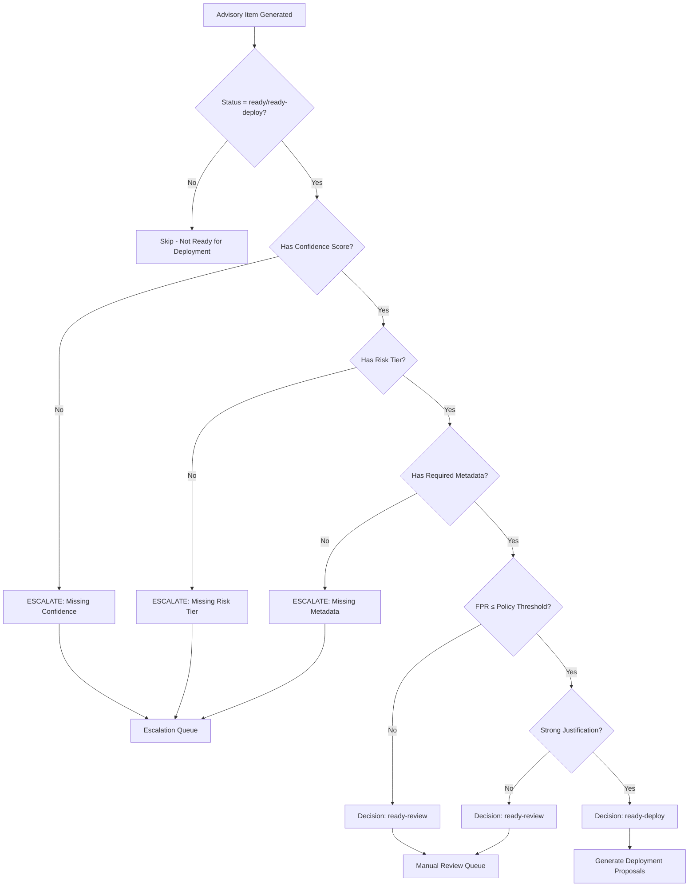

# Governance Decision Tree - v1.0 Pilot Readiness

## Overview
This document outlines the governance decision tree for v1.0 pilot deployment of Sigma advisory outputs. All advisory items must pass through these governance gates before production deployment.

## Decision Flow



## Governance Gates

### Gate 1: Confidence Scoring
- **Requirement**: All items must have `confidence_score` field
- **Range**: 0.0 - 1.0 (float)
- **Calculation**: Composite of FPR penalty (80%) + TPR bonus (20%) × sample factor
- **Escalation**: Items without confidence → `escalate-missing-confidence`

### Gate 2: Risk Tier Classification
- **Requirement**: All items must have `risk_tier` field
- **Values**: `blocking`, `hunting`, `enrichment`
- **Assignment**: Based on confidence/FPR thresholds in `configs/risk_tiers.yaml`
- **Escalation**: Items without tier → `escalate-missing-tier`

### Gate 3: Metadata Validation
**Required Fields**:
- `severity_label` (e.g., "High", "Medium", "Low")
- `rule_owner` (e.g., "Sigma", "Security-Team")
- `detection_type` (e.g., "hunting", "blocking", "enrichment")
- `sla` (SLA hours for response, integer)

**Escalation**: Missing any field → `escalate-missing-metadata`

### Gate 4: Policy Compliance
- **FPR Threshold**: Must meet risk tier's `max_fpr` requirement
- **Justification**: If policy requires justification, must have:
  - Non-empty `justification` field
  - Non-empty `evidence_quote` field  
  - Non-empty `operator` field

### Gate 5: Deployment Authorization
**Success Path**: Items passing all gates → `ready-deploy` → deployment proposals
**Review Path**: Items failing policy → `ready-review` → manual review queue

## Escalation Handling

### Missing Confidence (escalate-missing-confidence)
- **Reason**: Advisory lacks required confidence score
- **Action**: Route to data science team for backtesting
- **SLA**: 24 hours for confidence calculation

### Missing Risk Tier (escalate-missing-tier) 
- **Reason**: Advisory lacks required risk tier assignment
- **Action**: Route to risk team for classification
- **SLA**: 48 hours for tier assignment

### Missing Metadata (escalate-missing-metadata)
- **Reason**: Advisory lacks required operational metadata
- **Action**: Route to rule owner for completion
- **SLA**: 72 hours for metadata enrichment

## Governance Attestation

Approved items receive:
```json
{
  "governance_status": "approved",
  "governance_timestamp": "2025-01-15T10:30:00Z",
  "governance_gates_passed": [
    "confidence_validation",
    "risk_tier_validation", 
    "metadata_validation",
    "policy_compliance"
  ]
}
```

## Deployment Targets

Post-governance items are proposed for deployment to configured target systems:
- **Shadow Mode**: Logging only, no blocking
- **Limited Rollout**: Subset of traffic/users
- **Full Production**: Complete deployment (future milestone)

## Audit Trail

All governance decisions are logged with:
- Item ID and pattern
- Decision timestamp
- Gate results (pass/fail/escalate)
- Escalation reasons (if applicable)
- Reviewer assignments
- Resolution timestamps